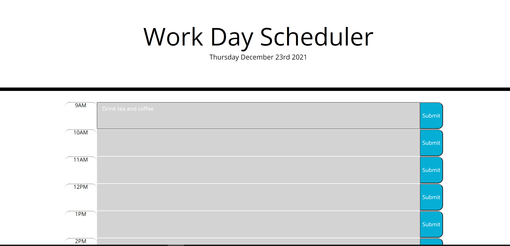
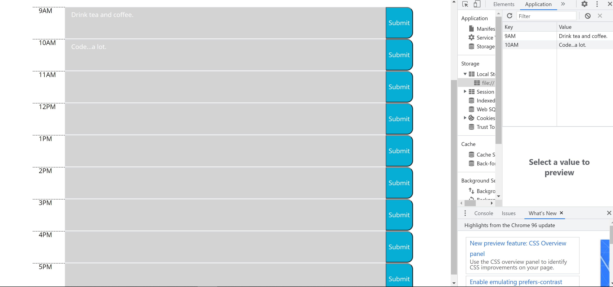

# Calendar-Application
This is a calendar application I helped make using HTML, CSS, and JavaScript. 

## Introduction:
I was provided with some starter code and I utilized my knowledge of Bootstrap, JavaScript, Moment.js, and jQuery to create the project.

## General Information:

In this project, I used Bootstrap, jQuery, and JavaScript to display the current date along with time blocks for standard business hours (9 a.m. - 5 p.m.). The user can view color-coded time blocks to see whether that particular time is in the past, present, or future. They may also enter events in a space provided to save their schedule. Entered events are saved to local storage and can be retreived upon refreshing the page.

I used the following  tools:
1. HTML
2. CSS
3. JavaScript
4. jQuery
5. Moment.js
6. Bootstrap

## Screenshots:

## Built with:

1. Visual Studio Code
2. Chrome DevTools
3. A little bit of markdown

## GitPages Link:

You can find my website here:
https://mully7773.github.io/Calendar-Application/

## Author:

Nick Mullenmeister